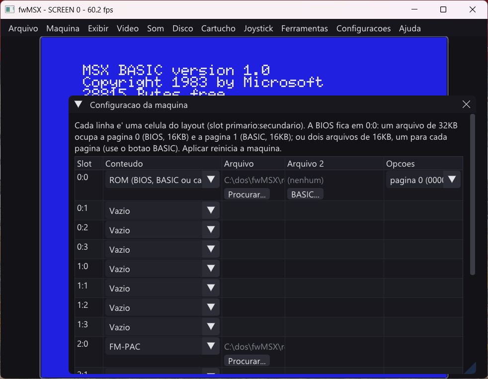

# fwMSX

**fwMSX** e um projeto de aprendizado com o objetivo final de se tornar um
emulador de MSX, evoluido a partir do [fMSX](https://fms.komkon.org/fMSX/)
(Marat Fayzullin), com o aval do autor original para essa adaptacao. A base
do fMSX e C/Unix; a ideia aqui e reestrutura-la, modernizar e, ao longo do
caminho, estudar e reaproveitar codigo de outros emuladores/ferramentas de
MSX (ver [resource/](resource/)).

> **Este projeto NAO substitui o fmsxGO** (o projeto principal). O fwMSX e
> apenas para aprendizado: praticar o ferramental MSYS2 no Windows e me
> atualizar com C/C++/Fortran/Assembly mais atuais.

Por se tratar de um projeto de estudo, ele tem uma regra propria, alem de
"emular um MSX direito": **toda fase relevante do projeto precisa exercitar
codigo real em C, C++, Assembly e Fortran** -- mesmo quando minimo -- para
forcar contato pratico com interoperabilidade entre linguagens (ABI,
name mangling, calling conventions, linkedicao).

## Estado atual (v1.29.0 "King's Valley: Save-state")



O **fwMSX e um emulador de MSX** (MSX1, MSX2 e MSX2+) escrito em C, C++, Assembly e Fortran. Sem
argumentos, `fwMSX.exe` abre a maquina MSX1 numa janela, com a BIOS real e o MSX BASIC.

**Funciona hoje:**

- **Maquinas**: MSX1 (BASIC 1.0), MSX2 (BASIC 2.1) e MSX2+ (BASIC 3.0, V9958), ate o prompt do BASIC.
- **Disco**: MSX-DOS 1.8 a partir de `.dsk`, com leitura e gravacao (e protecao contra gravacao); tambem pela
  controladora por portas (estilo Microsol, driver DDX 3.0/CDX-2), formatos 180/360/720 KB.
- **Fita** (`.cas`, `.tsx`/`.tzx`): leitura (modo rapido e normal, com som), gravacao (`CSAVE`/`BSAVE "CAS:"`,
  fita nova, protecao, 3 modos, marcar o ponto, contagiros), janela visual "Fita K7", e a ferramenta de linha
  de comando `fwmsx --cas` (empacotar `.BIN`/`.BAS` num `.TSX`, "ripar" uma gravacao `.wav` real, listar o
  conteudo de uma fita). Navegacao completa dos blocos de controle do TZX (grupos/lacos/saltos/chamadas/
  selecao). Banco de fitas com metadados (`fwmsx --fitadb`, titulo/empresa/ano/SHA-1, SEM download). Ver
  [tape-spec.md](doc/tape-spec.md).
- **Cartuchos**: ROM plana, MegaROM (Konami, ASCII, Gen8, Gen16), SRAM com `.sav`, o SCC (F1 Spirit toca
  a trilha) e MSX-DOS 2 (cartucho generico, `--cart <rom> msxdos2`, testado com um kernel 2.30 real).
- **Video**: VDP completo: SCREEN 0 a 8 no V9938 e 10 a 12 no V9958 (YJK, YAE e scroll); efeitos
  de rastreio no meio do quadro (paleta/scroll trocados por interrupcao de linha).
- **Som**: PSG, SCC e **FM (MSX-MUSIC e FM-PAC)** com os comandos de BASIC (`CALL MUSIC`, `PLAY #n`, `CALL VOICE`), modo ritmo e saida ao vivo.
- **Layout de slots mais amplo**: RAM de 16 KB no fim da celula, RAM de 32 KB em duas celulas, mapper de 64 KB a 4 MB (varios mappers), BIOS Expert 1.1 subindo.
- **Banco de ROMs** (`fwmsx --romdb` e menu **ROMs**): baixa o fMSX 6.0, o System ROMs do file-hunter e o banco
  do Vampier; busca, edicao e identificacao; `verify` confere o SHA-1 de cada ROM contra o banco (arquivo
  faltando/alterado); `--cart` sem mapper explicito consulta o banco (SHA-1) antes da heuristica por tamanho.
  As ROMs nao vem com o emulador (ver [romdb-spec.md](doc/romdb-spec.md)).
- **Configuracao**: menu **Maquina > Configuracao de slots...**: 16 celulas (BIOS, BASIC, RAM de 16 a 64 KB, mapper de 64 a 1024 KB, cartucho, disco, sub-ROM e FM-PAC).
- **Save-state**: menu **Arquivo > Salvar estado.../Carregar estado...** (`.sst`) -- grava/restaura
  Z80, VDP, PSG, SCC, OPLL, PPI, controladora de disco e RAM/RAM de mapper. Aplica sobre a maquina
  ja' rodando (nao recarrega BIOS/cartucho/disco/fita). Ver [savestate-spec.md](doc/savestate-spec.md).
- **Janela**: menus do fMSX, zoom, proporcao, tela cheia e filtros de video -- confirmados na tela.

**Limites (detalhes em [RELEASE.md](doc/RELEASE.md) e [SPEC.md](doc/SPEC.md), secao 5.0):**

- O **som do FM, do SCC e da fita (modo normal)** ainda nao foram comparados com hardware real. Use `--wav` para gravar e ouvir.
- **Fita**: download de fitas pelo site continua fora de escopo (sem termos de uso publicados -- so' o
  banco de metadados, sem download, existe); `.cas` cru sem gravacao previa deste emulador ainda
  adivinha o preenchimento de alinhamento; um arquivo ASCII multi-bloco de verdade (256 bytes por bloco)
  aparece fragmentado na lista; "Selecao" (#28 do TZX) nao tem como mostrar um menu de verdade numa
  ferramenta batch -- escolhe sempre a 1a opcao. Ver [tape-spec.md](doc/tape-spec.md), secoes 5, 9, 10 e 11.
- **Jogos**: Lode Runner + SCC nao sobe; Parodius (Smooth Scroll) mostra tela fragmentada; Mega Chase
  so' validado ate o titulo; F-1 Spirit 3D: troca de disco pela janela nao testada.
- **Ausentes**: GameMaster2, `CALL VOICECOPY` e opcao de linha de comando para o layout de slots.
  Save-state nao valida se o cartucho/disco/fita inserido agora e' o mesmo de quando foi salvo.
- **BIOS**: so' em 0:0. Outras BIOS (ex.: Gradiente Expert 1.1) montam no layout, mas nao foram testadas.

**Configurar a maquina** (menus da janela; a lista completa de opcoes de linha de comando esta no
[MANUAL](doc/MANUAL.md)):

- **Maquina > Modelo**: MSX1, MSX2 ou MSX2+ (volta o layout ao padrao).
- **Maquina > Configuracao de slots...**: monta o layout celula a celula. Exemplos que funcionam:
  - uma BIOS de 32KB em 0:0 (a pagina 0 recebe a BIOS, a pagina 1 o BASIC);
  - BIOS e BASIC em dois arquivos de 16KB, na mesma celula 0:0;
  - quatro bancos de RAM de 64KB no slot 2 (celulas 2:0 a 2:3);
  - um mapper de 1024KB no slot 3:1.
- **Cartucho**: insere ou retira o cartucho do slot 1:0.
- **FM-PAC**: liga ou desliga o FM-PAC no slot 2:0 (ligado por padrao quando o `FMPAC.ROM` existe).
- **Disco**: insere e ejeta os discos A: e B:.
- **Fita**: inserir, criar fita nova, ejetar, rebobinar, trocar o modo de carregamento, destravar/travar
  contra gravacao, escolher o modo de gravacao, e a janela visual "Fita K7".
- **Exibir, Video, Som e Configuracoes > Interface**: aparencia e audio.

Historico das versoes, em uma linha cada: 1.12.0 abre a maquina sem argumentos; 1.13.0 SCC;
1.14.0 CPIR/CPDR em Assembly; 1.15.0 MSX2+ (V9958); 1.16.0 janela com menus e filtros; 1.17.0 FM com
BASIC, layout de slots e SRAM do FM-PAC; 1.18.0 banco de ROMs e disco por portas; 1.19.x fita (leitura);
1.20.x fita (gravacao); 1.21.0 empacotador `.BIN`/`.BAS` -> `.TSX` (`--cas pack`); 1.22.0 ripper de
`.WAV` (`--cas rip`); 1.23.0 navegacao de blocos de controle do TZX; 1.24.0 banco de fitas com
metadados (`--fitadb`, sem download); 1.25.0 banco de ROMs com `verify` e auto-mapper pelo SHA-1;
1.26.0 Vampier com Platform/CRC32/tamanho; 1.27.0 efeitos de rastreio no meio do quadro;
1.28.0 MSX-DOS 2 (cartucho generico); **1.29.0 save-state**. Detalhes em
[CHANGELOG.md](doc/CHANGELOG.md).

Veja [doc/SPEC.md](doc/SPEC.md) para a especificacao completa e o historico de fases (documento vivo).

**Onde paramos e o que falta:** [OUTLINE.md](OUTLINE.md), feito para retomar o trabalho em outro computador ou com outra IA.

**Politica de midias:** este repositorio e' pessoal. ROMs, discos e fitas de terceiros podem ser versionadas por enquanto. Antes de liberar o projeto ao publico, cada midia de terceiros sera revisada, e os arquivos cujos detentores de direitos estiverem em desacordo serao removidos (ver LICENSE-THIRD-PARTY.md).

## Estrutura do projeto

```
fwMSX/
├── src/            fontes do projeto, um subdiretorio por linguagem
│   ├── cpp/        ponto de entrada (main) e modulo C++
│   ├── c/          modulo C
│   ├── asm/        modulo Assembly (NASM, ABI Win64)
│   ├── fortran/    modulo Fortran
│   ├── common/     cabecalhos compartilhados (versao, etc.)
│   ├── msxdisk/    utilitario de imagens de disco MSX (core/cli/shell/
│   │               tui/gui/config -- ver doc/msxdisk-spec.md)
│   ├── z80/        nucleo da CPU Z80 (core/cpp/asm/fortran/debug --
│   │               ver doc/z80-core-spec.md)
│   ├── memmap/     mapa de memoria MSX -- slots/subslots/MegaROM
│   │               (core/cpp/fortran -- ver doc/memory-map-spec.md)
│   ├── vdp/        VDP (TMS9918/V9938) -- registradores/portas/
│   │               renderizacao (core/cpp/fortran -- ver doc/vdp-spec.md)
│   ├── ppi/        PPI i8255 + teclado (core/cpp/fortran/asm -- ver
│   │               doc/ppi-spec.md)
│   ├── psg/        PSG AY-3-8910 (core/cpp/fortran -- ver doc/psg-spec.md)
│   ├── scc/        chip de som SCC (core/asm/fortran/cpp -- ver doc/scc-spec.md)
│   ├── fm/         chip FM OPLL (MSX-MUSIC/FM-PAC; core/asm/fortran/cpp -- ver doc/fm-spec.md)
│   ├── rtc/        relogio RTC do MSX2 (header-only -- ver doc/msx2-spec.md)
│   ├── fdc/        controladora de disquete WD2793 (core/cpp -- ver
│   │               doc/fdc-spec.md)
│   ├── tape/       fita (.CAS, .TSX/.TZX), gancho de BIOS, pulsos KCS e
│   │               a CLI `fwmsx --cas` (core/cpp/fortran/asm/cli -- ver
│   │               doc/tape-spec.md)
│   ├── romdb/      banco de ROMs (SQLite, downloads, CLI `--romdb` --
│   │               ver doc/romdb-spec.md)
│   ├── tapedb/     banco de fitas (SQLite, SEM download, CLI `--fitadb`
│   │               -- ver doc/tape-spec.md, secao 11)
│   ├── audio/      saida de audio ao vivo (miniaudio -- ver
│   │               doc/audio-spec.md)
│   └── machine/    maquina MSX1 completa + janela (`--msx` -- ver
│                   doc/machine-spec.md)
├── tools/msxdisk/  ponto de entrada do executavel msxdisk standalone
├── tests/z80/      testes do nucleo Z80, memoria, VDP, PPI, PSG, maquina,
│                   audio, disco e fita (CTest -- z80test/z80dbgtest/
│                   memmaptest/vdptest/vdp2test/ppitest/psgtest/
│                   machinetest/msx2test/audiotest/fdctest/tapetest/
│                   castooltest), mais tests/romdb/ (romdbtest) e tests/tapedb/ (tapedbtest)
├── doc/            documentacao viva do projeto
│   ├── SPEC.md         especificacao completa + fases do projeto
│   ├── msxdisk-spec.md especificacao + fases do utilitario msxdisk
│   ├── z80-core-spec.md especificacao + fases do nucleo Z80
│   ├── memory-map-spec.md especificacao + fases do mapa de memoria
│   ├── vdp-spec.md      especificacao + fases do VDP
│   ├── ppi-spec.md      especificacao + fases do PPI/teclado
│   ├── psg-spec.md      especificacao + fases do PSG
│   ├── scc-spec.md      especificacao + fases do SCC
│   ├── fm-spec.md       chip FM (MSX-MUSIC e FM-PAC) e comandos de BASIC
│   ├── tape-spec.md     fita: .CAS/.TSX/.TZX, gravacao, `--cas` (pack/rip/list), navegacao do TZX
│   ├── romdb-spec.md    banco de ROMs (SQLite, downloads, CLI)
│   ├── slots-spec.md    layout de slots e configuracao da maquina
│   ├── sram-spec.md     SRAM de cartucho e FM-PAC (arquivos .sav)
│   ├── machine-spec.md  maquina completa + janela com teclado do host
│   ├── audio-spec.md    audio ao vivo
│   ├── fdc-spec.md      disco: controladora WD2793 + MSX-DOS
│   ├── msx2-spec.md     MSX2: VDP V9938, mapper de RAM, RTC
│   ├── MANUAL.md       como compilar e executar
│   ├── CHANGELOG.md    resumo das alteracoes entre versoes
│   └── RELEASE.md       detalhes de cada release
├── images/         imagens usadas nesta documentacao
├── dist/           pacote pronto para execucao (.exe + .zip)
├── resource/       codigo-fonte de terceiros usado como referencia/estudo
├── CMakeLists.txt  build raiz (CMake + Ninja)
├── build.ps1       script de build (PowerShell/Windows)
└── build.sh        script de build (Bash/Linux)
```

## Compilar e executar

Resumo rapido (toolchain: MSYS2 UCRT64 -- gcc/g++/gfortran/nasm/cmake):

```powershell
.\build.ps1
.\dist\fwMSX.exe
.\dist\msxdisk.exe          # utilitario de disco standalone (CLI/shell/TUI/GUI)
```

Instrucoes completas, pre-requisitos e saida esperada em
[doc/MANUAL.md](doc/MANUAL.md).

## Versionamento

Formato `X.Y.Z`, sem tags numericas isoladas -- cada versao recebe o nome de
um jogo classico de MSX e um subtitulo curto indicando onde o projeto esta
naquele ponto (ex.: `v1.1.2 -- "Nemesis: Renomeacao"`). Regras completas em
[doc/SPEC.md](doc/SPEC.md#versionamento); detalhes de cada release em
[doc/RELEASE.md](doc/RELEASE.md); resumo das mudancas em
[doc/CHANGELOG.md](doc/CHANGELOG.md).

## Creditos

- **[Marat Fayzullin](https://fms.komkon.org/fMSX/)** -- autor original do
  fMSX, sobre o qual o fwMSX e construido (com aval do proprio autor para
  esta adaptacao/evolucao). O setor de boot real do MSX-DOS 1 usado pelo
  `msxdisk` (`src/msxdisk/core/msxdos1_boot.cpp`) e contribuicao direta
  dele (`resource/DiskUtilities/Boot.h`). O motor de despacho, tabelas e
  desmontador da CPU Z80 (`src/z80/core/`, `src/z80/debug/z80_disasm.*`)
  sao adaptados de `resource/fMSX/Z80/` (`Z80.c`, `Tables.h`, `Codes*.h`,
  `Debug.c`) -- ver `doc/z80-core-spec.md` e `LICENSE-THIRD-PARTY.md`. O
  motor de slots/subslots e os mappers MegaROM (`src/memmap/core/`) sao
  adaptados de `resource/fMSX/fMSX/MSX.c`/`MSX.h` -- ver
  `doc/memory-map-spec.md`. O motor "digital" do VDP e a renderizacao de
  SCREEN 0/1/2 (`src/vdp/core/`) sao adaptados de
  `resource/fMSX/fMSX/MSX.c` (registradores/portas/interrupcao) e
  `resource/fMSX/fMSX/Common.h` (`RefreshLine0/1/2`) -- ver
  `doc/vdp-spec.md`.
- **Arnold Metselaar** -- autor do utilitario original de manipulacao de
  discos MSX (`resource/DiskUtilities/DiskUtil.c` e correlatos), usado
  como referencia de estudo do formato FAT12/MSX-DOS para o `msxdisk`
  (nunca portado linha a linha -- ver `doc/msxdisk-spec.md`, secao 2).
- **msxDiskUtil** (`resource/msxDiskUtil/`) -- projeto irmao do mesmo
  autor do fwMSX, reescrita em PureBasic do utilitario acima; usado para
  confirmar, de forma independente, o setor de boot do MSX-DOS 1.
- Bibliotecas de terceiros usadas pelo `msxdisk` (baixadas via CMake
  `FetchContent` no build, nao redistribuidas neste repositorio):
  [CLI11](https://github.com/CLIUtils/CLI11),
  [replxx](https://github.com/AmokHuginnsson/replxx),
  [FTXUI](https://github.com/ArthurSonzogni/FTXUI),
  [Dear ImGui](https://github.com/ocornut/imgui),
  [GLFW](https://www.glfw.org/), [SQLite](https://www.sqlite.org/) e
  [miniaudio](https://github.com/mackron/miniaudio) (audio do emulador).

## Licenca

O **codigo original do fwMSX e do msxdisk** (tudo escrito para este
projeto) e licenciado em **BSD 3-Clause** -- ver [LICENSE](LICENSE).

Isso **nao** cobre codigo adaptado/incorporado de terceiros. O fMSX tem
sua propria licenca, mais restritiva (proibe distribuicao comercial); o
fwMSX evolui a partir dele com o aval do proprio Fayzullin **para
adaptar/estudar seu codigo**, mas esse aval nao e uma autorizacao para
relicenciar o codigo dele sob BSD/GPL/MIT. Por isso, qualquer arquivo
deste repositorio que incorporar codigo do fMSX diretamente (o setor de
boot em `src/msxdisk/core/msxdos1_boot.cpp`; o motor/tabelas/desmontador
da CPU Z80 em `src/z80/core/` e `src/z80/debug/z80_disasm.*`; o motor de
slots/subslots e mappers MegaROM em `src/memmap/core/`; o motor do VDP e
a renderizacao em `src/vdp/core/`; o PSG em `src/psg/core/`; o SCC em
`src/scc/core/`; mais arquivos devem se juntar a essa lista) continua sob a licenca original
dele, nao BSD. Ver
**[LICENSE-THIRD-PARTY.md](LICENSE-THIRD-PARTY.md)** para o
detalhamento completo (fMSX, DiskUtilities, msxDiskUtil) e
[resource/README.md](resource/README.md) para o aviso sobre o material
de terceiros usado so como referencia de estudo.
